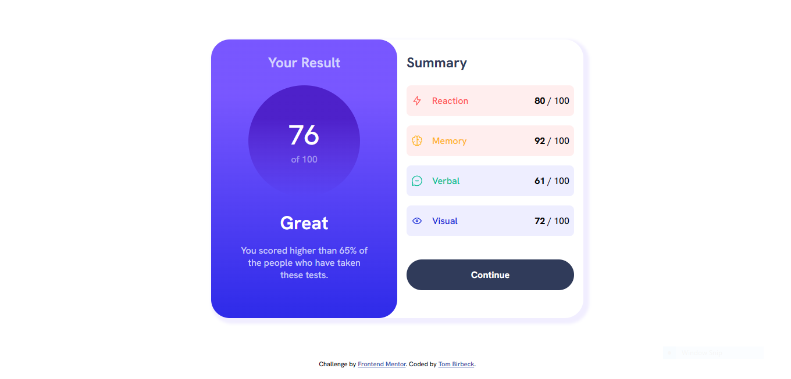

# Frontend Mentor - Results summary component solution

This is a solution to the [Results summary component challenge on Frontend Mentor](https://www.frontendmentor.io/challenges/results-summary-component-CE_K6s0maV). Frontend Mentor challenges help you improve your coding skills by building realistic projects. 

## Table of contents

- [Overview](#overview)
  - [The challenge](#the-challenge)
  - [Screenshot](#screenshot)
  - [Links](#links)
- [My process](#my-process)
  - [Built with](#built-with)
  - [What I learned](#what-i-learned)
  - [Continued development](#continued-development)
- [Author](#author)

## Overview

To recreate this component for desktop:

### The challenge

Users should be able to:

- View the optimal layout for the interface depending on their device's screen size
- See hover and focus states for all interactive elements on the page

### Screenshot

Here is my solution:

### Links

- Solution URL: [Solution](https://www.frontendmentor.io/solutions/results-summary-component-desktop-CKi8bF5wav)
- Live Site URL: [Live site](https://tombirbeck.github.io/frontend-mentor-results-summary-component/)

## My process

My initial step was to remove any padding and margin applied to the page and set the box-sizing to border-box in order to enable me to control the element sizes.
I then created a framework of the HTML elements and styled with CSS to recreate the way the page looks.
When I was happy with the layout I used a JavaScript file to fetch the data.json file. I used query selectors to 'grab' the HTML elements I needed and created functions to iterate over the information in the data.json file and inject the correct information into the elements on the page.

### Built with

- Semantic HTML5 markup
- CSS custom properties
- Flexbox
- CSS Grid
- JavaScript

### What I learned

This challenge was really good for working on CSS gradients and layouts using a combination of grid and flexbox.

## Author

- Website - [Portfolio](https://portfolio-tombirbeck.vercel.app/)
- Frontend Mentor - [@TomBirbeck](https://www.frontendmentor.io/profile/TomBirbeck)

